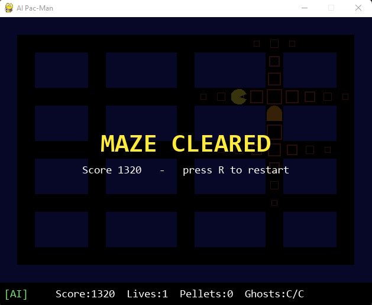

# AI Pac-Man: A* Pathfinding with Danger-Aware Cost Shaping

A grid-based Pac-Man maze where the player character is driven by A* pathfinding.
The AI selects which pellet to pursue, routes to it around walls, and treats
cells near ghosts as expensive to walk through — so avoidance emerges from the
cost function rather than from hard-coded rules.

Built with Python and Pygame. No external AI APIs, no machine-learning model,
no assets — everything is drawn with primitive shapes.


---

## Overview

The mechanical problem — get from A to B in a maze — is solved by A*. The
interesting problem is *which B to pick* when some destinations are dangerous,
and how to reconsider when the situation changes. This project is a testbed for
goal selection under threat, with the AI's reasoning drawn directly on screen.

- Maze: 21x15 grid, 135 walkable cells, 132 pellets
- Two ghosts using greedy best-first movement (deliberately, as a contrast)
- Pac-Man moves every 8 frames; ghosts every 12

## Features

- **A\* pathfinding** with Manhattan distance heuristic, implemented as pure
  logic with no Pygame dependency so it can be tested from the terminal
- **BFS flood fill** for wall-aware ghost distance maps
- **Danger-aware cost shaping** — ghost proximity raises the cost of entering a
  cell, so A* routes around threats without any explicit avoidance rule
- **Live AI visualisation** — the planned path, the chosen target pellet, and
  the ghost danger field are all rendered, with danger severity encoded by
  marker size rather than colour
- **AI / manual toggle** (Tab) for side-by-side comparison
- Score, lives, respawn, win and game-over states, restart
- Headless test suite that measures AI behaviour without opening a window

## AI approach

```
Game state
   |
Identify candidate pellets      (shortlist by Manhattan distance)
   |
Compute wall-aware ghost distances   (one BFS per ghost)
   |
Run danger-aware A* to each candidate
   |
Choose lowest risk-adjusted cost
   |
Move one cell along the path
   |
Replan when the plan is stale or a ghost blocks the next step
```

### Target selection: a two-stage filter

Running A* to all 132 pellets on every decision is wasteful — most are on the
far side of the maze and could never win. Instead:

1. **Shortlist cheaply.** Sort pellets by Manhattan distance, keep the nearest
   24. Pure arithmetic, no search.
2. **Decide accurately.** Run danger-aware A* on just those 24 for true
   risk-adjusted costs, and take the lowest.

Manhattan distance is optimistic, so it cannot hide a genuinely close pellet
from the shortlist. Cheap approximation narrows the field; the expensive exact
method chooses.

### Danger as step cost, not as a rule

Nothing in the code says "avoid ghosts." Entering a cell costs:

```
1 + DANGER_WEIGHT * max(0, DANGER_RADIUS - steps_to_nearest_ghost)
```

Multiple ghosts sum, so cells pinched between two are worst of all — adding the
second ghost required no change to the AI at all.

A* then routes around danger by itself. `DANGER_WEIGHT` is a single tuning
number that changes the AI's personality: at 0 it walks straight through
ghosts, at 30 it turns away before entering the danger zone.

### A* explained

Every cell (node) that A* considers gets three numbers:

| | meaning |
|---|---|
| **g(n)** | cost actually spent reaching n from the start — a fact |
| **h(n)** | estimated cost remaining from n to the goal — a guess |
| **f(n)** | `g(n) + h(n)`, the estimated total cost of a route through n |

A* repeatedly expands the frontier node with the lowest `f`, using a min-heap.
Concretely: *"I've walked 5 squares, and the goal looks 4 away, so this route
currently looks like a 9."* When a route detours or dead-ends, its `f` climbs
and A* sets it aside in favour of a cheaper alternative.

**Why not just one of the two numbers?**

- **Only h** is greedy best-first search — that's what the ghosts use. It lunges
  at whatever looks closer and gets pinned against walls, because going around
  means temporarily moving away.
- **Only g** is Dijkstra/BFS. Correct, but undirected: it expands outward in all
  directions equally, exploring cells behind you as eagerly as cells ahead.
- **g + h** is A*: correct *and* directed.

**Why Manhattan distance?** It matches the legal moves — four-way movement means
distance genuinely is vertical steps plus horizontal steps, where straight-line
distance would measure a diagonal you cannot walk. It also never overestimates,
since walls can only lengthen a journey. A heuristic that never overestimates is
**admissible**, and admissibility is what guarantees A* returns an optimal path.

Adding danger costs preserves this: the cheapest possible step is still 1, so the
estimate can never exceed the true remaining cost. A* stays optimal — now
optimal with respect to risk-adjusted cost rather than raw distance.

## Measured results

All figures produced by the included test scripts, not estimates.

### A* vs blind BFS — nodes expanded

| goal | steps | A* | BFS | saving |
|---|---|---|---|---|
| (10, 5) | 7 | 14 | 21 | 33% |
| (7, 10) | 15 | 42 | 68 | 38% |
| (4, 15) | 23 | 84 | 115 | 27% |
| (1, 19) | 30 | 135 | 135 | 0% |

The heuristic saves most for mid-range targets and nothing at all for
corner-to-corner. That is expected rather than disappointing: this maze is a
uniform lattice with no dead ends, so when the goal is at maximum distance
almost every cell lies on an optimal-cost route and there is nothing to prune.

### Danger-aware routing

Pac-Man at (7, 5), ghost at (7, 9), target pellet at (7, 13) — directly behind
the ghost:

| | steps | closest approach to ghost |
|---|---|---|
| Plain A* | 8 | 0 (walks through it) |
| Danger-aware A* | 24 | 4 |

Same algorithm, same heuristic, one changed cost function.

### Gameplay

Cleared the maze in 2 of 6 observed runs, typically reaching around 90% of
pellets before losing three lives.

## How to run

Requires Python 3.9+ (developed on 3.11.9) and Pygame (developed on 2.6.1).

```bash
pip install pygame
python main.py
```

**Controls**

| key | action |
|---|---|
| Tab | toggle AI / manual mode |
| Arrow keys | move (manual mode) |
| R | restart after win or game over |
| Esc | quit |

**Reading the visualisation**

- Small squares radiating from each ghost are the danger field; larger and
  thicker means more dangerous. Because they come from BFS, they bend around
  walls instead of forming a diamond.
- The ring marks the currently chosen target pellet.
- The filled squares ahead of Pac-Man are the planned A* route. It is usually
  short, since adjacent pellets are one step away; it becomes visible when
  Pac-Man has cleared his local area and must travel — which is exactly when
  planning matters.

## Project structure

```
Ai_PACMAN/
├── maze.py               # grid layout, wall/neighbour/distance helpers
├── pathfinding.py        # A* and BFS - pure logic, no Pygame import
├── ai.py                 # target selection and danger scoring
├── main.py               # window, game loop, input, rendering
│
├── test_pathfinding.py   # path validity, optimality, A* vs BFS node counts
├── test_danger.py        # danger cost spread and route avoidance
├── test_escape.py        # decisions across four ghost configurations
└── test_staleness.py     # replan cadence: safety vs decisiveness
```

The split between `pathfinding.py` and `ai.py` is intentional: the first answers
"how do I get to X and what does it cost", the second answers "which X should I
want". The first is a known algorithm; the second is the design work.

`pathfinding.py` importing no Pygame means A* is verifiable from the terminal —
which is how the paths were confirmed optimal before any of it touched the game.

## Development notes

Three problems found by measurement rather than by reading the code.

**The danger penalty was initially invisible.** The first design scored only the
*destination* for danger, leaving the route untouched — so Pac-Man would choose a
safer pellet and then walk to it straight through a ghost. Worse, the candidate
shortlist was 12 pellets, all within four cells, so every candidate received
nearly the same penalty. A constant added to every option cannot change which
option is smallest, and `DANGER_WEIGHT` was multiplying a constant. Two fixes:
move the cost inside A*'s cost function, and widen the shortlist to 24 so the
decision has genuine spread (11 distinct costs across 24 candidates).

**Entities could pass through each other.** Collision was detected by comparing
positions after both had moved. If Pac-Man and a ghost swapped adjacent cells in
the same step, they never shared a cell and the check missed. Fixed by comparing
positions before *and* after.

**Replan cadence is a documented trade-off, not a solved problem.** Because the
danger map reflects where ghosts *are* rather than where they are going, a
chasing ghost can invalidate a plan within a step or two. Replanning every step
measurably improved safety but caused target dithering:

| | deaths | steps toward ghost | pellets left | mid-route switches | reversals |
|---|---|---|---|---|---|
| Lazy replan (shipped) | 2.0 | 17.9 | 0.9 | 2 | 16 |
| Replan every step | 1.2 | 9.1 | 22.6 | 265 | 441 |

Averages over 8 seeded headless runs. Replanning constantly nearly halved the
approach steps but spent a third of its moves undoing the previous move and
stopped finishing the maze. A commitment bonus for the current target and a
reversal penalty halved the dithering without closing the gap. The shipped
version uses lazy replanning as a deliberate choice.

## Limitations

- The danger map is a snapshot of current ghost positions, with no prediction of
  where ghosts will move next.
- No adversarial reasoning — no minimax, no assumption that ghosts have intent.
- The escape fallback is one-step greedy, sharing the flaw the ghosts have. Its
  trigger threshold also proved nearly unreachable in practice, so it rarely
  fires.
- The maze is a uniform lattice with no dead ends and no wrap-around tunnels, so
  two chasing ghosts can pincer Pac-Man with no route out.
- Movement is cell-to-cell rather than smooth pixel interpolation.

## Future improvements

- **Predictive danger** — project ghost positions forward several steps and score
  against the forecast instead of the present.
- **Planned retreat** — replace the greedy escape with danger-aware A* toward a
  distant safe cell.
- **Fix the replan trade-off properly** — likely by penalising route changes
  rather than target changes, since the reversals came from route flips to the
  same destination.
- **Richer maze topology** — dead ends and tunnels would make both the
  pathfinding and the danger evaluation more interesting.
- **Power pellets** — a mode where ghosts become targets inverts the cost
  function, a clean extension of the existing design.

## Algorithmic AI vs machine learning

The AI here is **algorithmic**: behaviour comes from explicit search and scoring
over the current game state. There is no training data, no learned weights, and
no reward signal. It is deterministic given the same state, fully inspectable,
and tunable by hand — `DANGER_WEIGHT` alone shifts it from reckless to cautious,
with a predictable effect.

A reinforcement-learning agent would instead fit parameters from thousands of
episodes, would generalise to mazes it had never seen, and would be considerably
harder to debug when it misbehaved.

For a fully observable grid with known rules, search is the appropriate tool —
the optimal policy is computable directly, so there is nothing here that needs
to be learned.